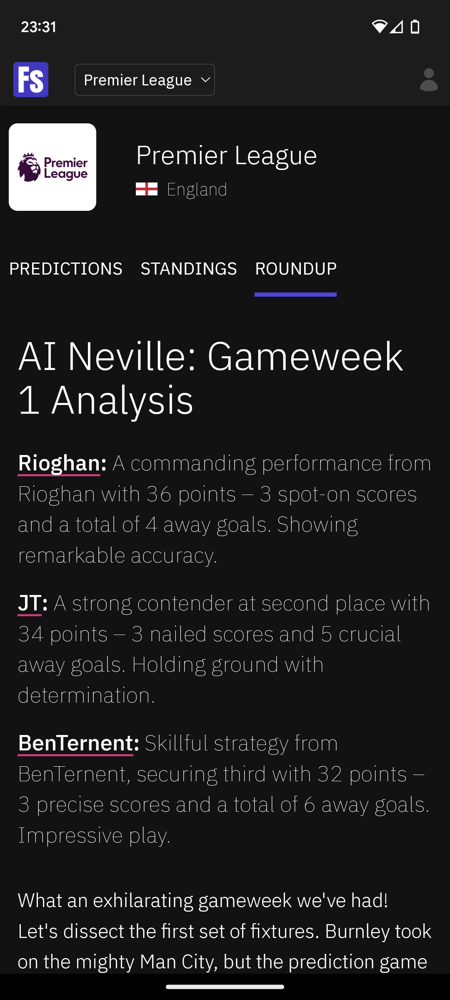
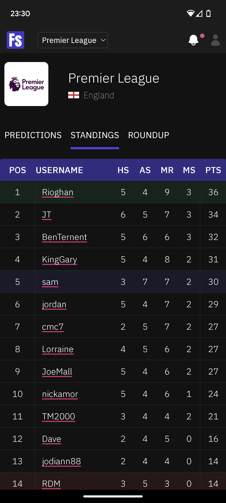
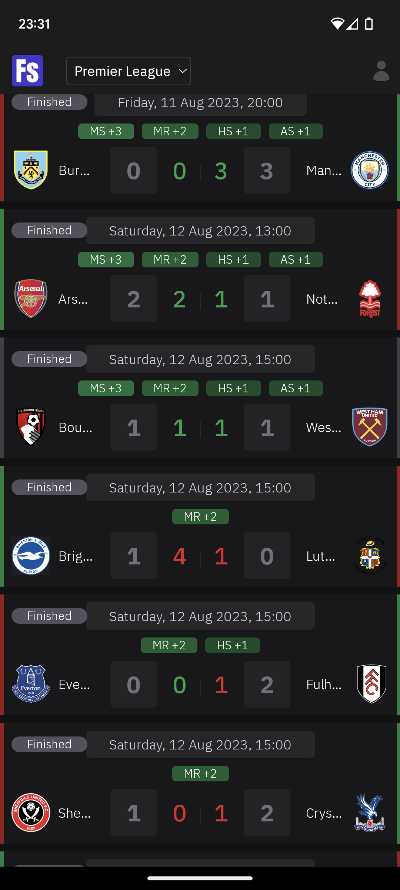

# samternent/home

## Apps
### ternent.dev

- https://ternent.dev
- https://api.ternent.dev
### footballsocial.app

> The friendly football score prediction game.

- https://footballsocial.app
- https://api.footballsocial.app

  
  
  
  
  

### gzip.app

- https://gzip.app

[JSON compression in the browser, with gzip and the Compression Streams API.](https://dev.to/samternent/json-compression-in-the-browser-with-gzip-and-the-compression-streams-api-4135)
### concords.app

- https://concords.app

### teamconcords.com

- https://teamconcords.com
## APIs

All APIs are currently served under the `apps` directory.

I'm currently migrating these to docker images images the `apis` directory.

## Packages

### concords-ledger
### concords-proof-of-work
### concords-identity
### concords-encrypt
### concords-utils
### sams-game-kit
